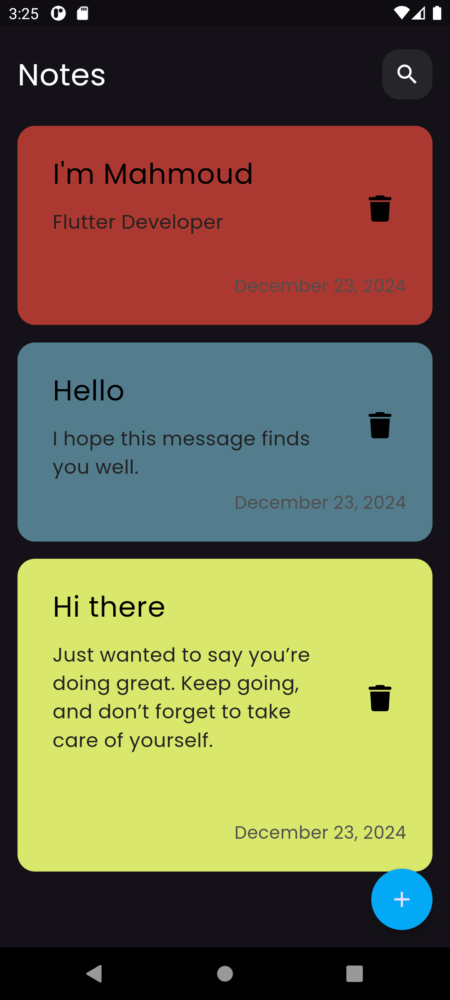
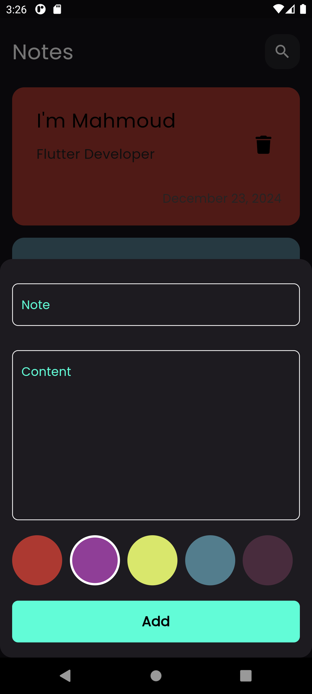
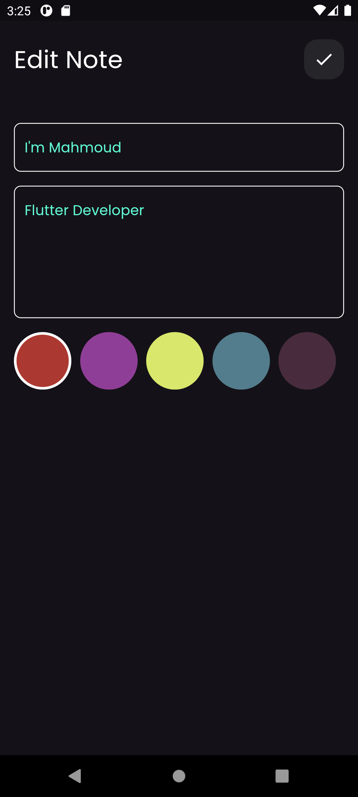
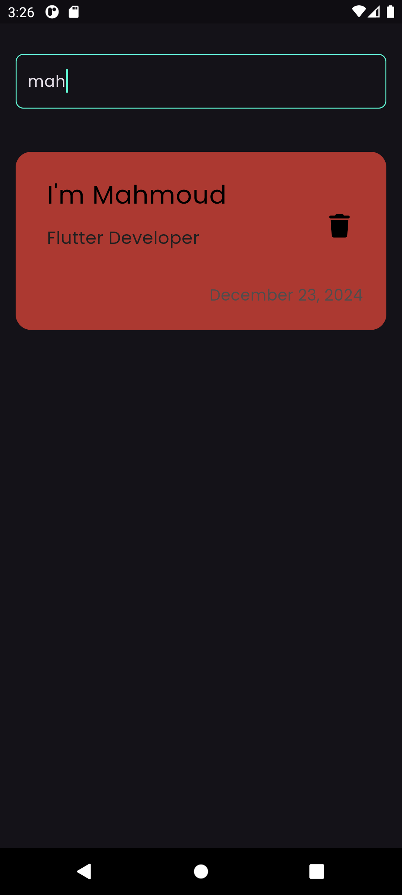

# Notes App

This is a Flutter-based note-taking application designed for efficient state management and a user-friendly interface.

## Features

- **Add Notes**: Quickly add notes with custom titles and descriptions.
- **Edit Notes**: Modify existing notes seamlessly.
- **Delete Notes**: Remove notes you no longer need.
- **Color Coding**: Assign colors to notes for better organization.
- **Search Functionality**: Easily find notes using the search feature.

## Project Structure

The project follows a modular structure for maintainability and scalability:

```
lib/
├── cubits/                        # State management using Cubit
│   └── notes_cubit/               # Handles overall notes state
│       ├── notes_cubit.dart
│       └── notes_state.dart
├── models/                        # Data models
│   ├── note_model.dart
│   └── note_model.g.dart
├── views/                         # UI components
│   ├── widgets/                   # Reusable UI components
│   │   ├── add_note_button_sheet.dart
│   │   ├── add_note_form.dart
│   │   ├── colors_list_view.dart
│   │   ├── custom_app_bar.dart
│   │   ├── custom_bottom.dart
│   │   ├── custom_formate_date.dart
│   │   ├── custom_search_icon.dart
│   │   ├── custom_text_field.dart
│   │   ├── edit_note_body.dart
│   │   ├── note_item.dart
│   │   ├── note_search_view.dart
│   │   ├── note_view_body.dart
│   │   ├── notes_list_view.dart
│   │   └── search_note_body.dart
│   ├── edit_note_view.dart
│   ├── notes_view.dart
│   └── search_note_view.dart
├── constants.dart
├── main.dart
```

### Detailed Explanation

#### State Management (Cubit)
- **Cubit** is used for managing the state of the application. Each feature (e.g., adding notes, managing notes) has its own Cubit and corresponding states.
  - `add_note_cubit.dart` and `add_note_state.dart`: Manage the addition of new notes, including validation and submission.
  - `notes_cubit.dart` and `notes_state.dart`: Handle fetching, updating, and deleting notes.

#### Models
- `note_model.dart`: Defines the structure of a note, including fields like title, description, color, and timestamp.
- `note_model.g.dart`: Contains code generated for JSON serialization and deserialization, enabling seamless data storage and retrieval.

#### Views
- **Main View (`notes_view.dart`)**: Displays a list of all notes and provides navigation options.
- **Edit View (`edit_note_view.dart`)**: Allows users to edit the details of an existing note.
- **Search View (`search_note_view.dart`)**: Provides functionality for searching through notes.

#### Widgets
- **Reusable Widgets**: Modular components like `add_note_form`, `colors_list_view`, and `custom_text_field` ensure consistency and reduce code duplication.
- **Custom App Bar**: Provides a unique, application-specific app bar.
- **Bottom Sheet**: Implements a slide-up interface for adding new notes.
- **Search Widgets**: Widgets like `note_search_view` and `search_note_body` enhance the search functionality.

## Getting Started

### Prerequisites

Ensure you have the following installed:
- [Flutter](https://flutter.dev/docs/get-started/install)
- Dart SDK

### Installation

1. Clone the repository:
   ```bash
   git clone https://github.com/your-username/notes-app.git
   cd notes-app
   ```

2. Install dependencies:
   ```bash
   flutter pub get
   ```

3. Run the app:
   ```bash
   flutter run
   ```

## Screenshots

Here are some screenshots of the Notes App:

### Home Screen


### Add Note


### Edit Note


### Search Notes


## Contributing

Contributions are welcome! Please follow these steps:
1. Fork the repository.
2. Create a new branch:
   ```bash
   git checkout -b feature/your-feature-name
   ```
3. Commit your changes:
   ```bash
   git commit -m "Add your feature description"
   ```
4. Push to the branch:
   ```bash
   git push origin feature/your-feature-name
   ```
5. Open a Pull Request.

## License

This project is licensed under the MIT License. See the [LICENSE](LICENSE) file for details.

## Acknowledgments

- [Flutter](https://flutter.dev/) for providing a great framework.
- The open-source community for inspiration and support.
